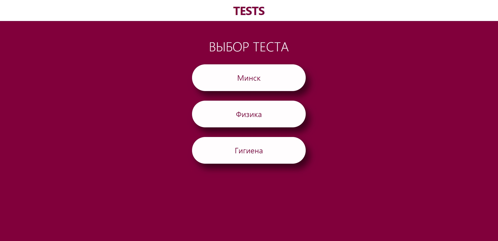

<h1 align="center">TESTS</h1>

<h2 align="center">
  <a href="https://nikulin-andrey.github.io/Tests/">Live Demo on GitHab Pages</a>
</h2>

## Description
Этот проект создан для моего протфолио. Сайт представляет из себя интерфейс для проведения тестов. На первом экране отображаются все доступные тесты, после выбора теста открывается его описание и кнопка *"Начать"*. После клика по кнопке *"Начать"* появляется список вопросов, возможен выбор нескольких вариантов ответа. Вверху слева отображается таймер, когда время закончится, то тест автоматически проверится. Внизу теста имеется кнопка *"Завершить"*. Нельзя завершить тест пока не ответили на все вопросы.

## About the project

### Основные технологии:

- **HTML** + **CSS**
- **JavaScript**
- **Git**

Это мой первый проект в портфолио, поэтому приложение написано на чистом **JavaScript**. Но приложение все равно можно легко расширить, добавить новые тесты, поменять язык или добавить новые функции.
